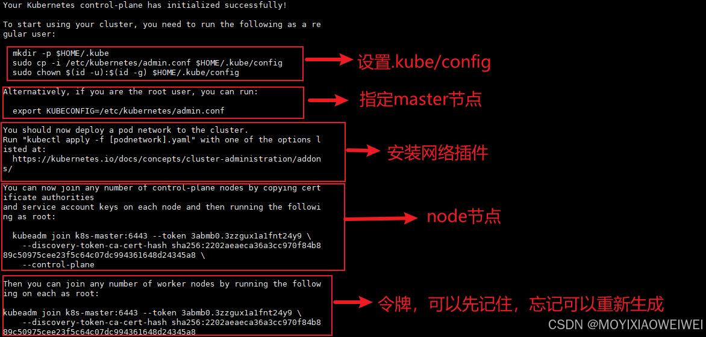

###### 给jar包仅替换class文件
jar uf test-platform-0.0.1-SNAPSHOT.jar BOOT-INF/classes/com/ynqd/test/service/impl/CsDailyServiceImpl.class

### linux命令

###### 修改密码
passwd xxx

###### 用户修改权限
su - root  
visudo  
在打开的配置文件中，找到root ALL=(ALL) ALL，在下面添加一行
xxx ALL=(ALL) ALL 其中xxx是你要加入的用户名称

###### 修改dns配置
cd /etc/sysconfig/network-scripts/  
vim ifcfg-enp0s3  
增加DNS1=8.8.8.8
sudo vim /etc/resolv.conf  
增加nameserver 8.8.8.8

### docker命令
###### 创建docker目录  
mkdir -p /etc/docker

###### 创建文件并编辑；#注意配置文件逗号不能少！  
vim /etc/docker/daemon.json 
{
"registry-mirrors": [
"https://mirror.iscas.ac.cn",
"https://hub.docker.com",
"https://z1jz4vf2.mirror.aliyuncs.co",
"https://dc.j8.work",
"https://docker.m.daocloud.io",
"https://dockerproxy.net",
"https://docker.mirrors.ustc.edu.cn",
"https://docker.nju.edu.cn"

]
}

###### 重载配置文件  
systemctl reload docker

###### 重新启动docker
systemctl restart docker 
sudo usermod -aG docker $USER

###### 查看镜像  
docker images  
###### 查看容器
docker ps -a

###### 查看日志
docker logs
###### 进入容器的命令  
docker exec -it 容器 /bin/bash
docker exec -it 容器 /bin/sh

###### 修改容器自启动
docker update --restart=always mysql

###### 如果是root用户，可能是因为环境变量设置有问题，可以通过
export PATH=/usr/local/sbin:/usr/local/bin:/usr/sbin:/usr/bin:/sbin:/bin
来修复。  
vi /etc/profile  
systemctl daemon-reload

###### 安装mysql  
docker pull mysql:8.0.36  
cd mysql  
docker run \
--restart=always \
-p 3306:3306 \
--name mysql \
-v /home/mysql/conf:/etc/mysql/conf.d \
-v /home/mysql/logs:/logs \
-v /home/mysql/data:/var/lib/mysql \
-e MYSQL_ROOT_PASSWORD=root \
-d mysql:8.0.36  \
--lower-case-table-names=1

###### 安装redis  
docker pull redis:7.4.1
cd redis  
docker run \
--restart=always \
-p 6379:6379 \
--name redis \
-v /home/redis/data:/data  \
-v /config/redis.conf:/usr/local/etc/redis/redis.conf \
-d redis:7.4.1  

###### 安装nginx
docker pull nginx:1.26.2  
cd nginx  
docker run \
--restart=always \
--name nginx \
-p 80:80  \
-v /home/nginx/conf/nginx.conf:/etc/nginx/nginx.conf \
-v /home/nginx/conf/conf.d:/etc/nginx/conf.d \
-v /home/nginx/logs:/var/log/nginx \
-v /home/nginx/html:/usr/share/nginx/html \
-d nginx:1.26.2
###### 复制默认配置到宿主机再挂载
docker run --rm nginx cat /etc/nginx/nginx.conf > /home/nginx/conf/nginx.conf   

###### 安装minio  
docker pull minio/minio  
docker run \
-p 9000:9000 \
-p 9090:9090 \
--name minio \
-d --restart=always \
-e "MINIO_ROOT_USER=minioadmin" \
-e "MINIO_ROOT_PASSWORD=minioadmin" \
-v /home/minio/data:/data \
-v /home/minio/config:/root/.minio \
minio/minio server \
/data --console-address ":9090" -address ":9000"

###### 安装ollama
docker pull ollama/ollama
docker run -d \
--name ollama \
-v /home/ollama:/root/.ollama \
-p 11434:11434 ollama/ollama

docker run -d -p 10000:8080 \
--add-host=host.docker.internal:host-gateway \
-v open-webui:/app/backend/data \
--name open-webui \
--restart always ghcr.io/open-webui/open-webui:main

###### 安装ollama
docker pull ollama/ollama
docker run -d \
--name ollama \
-v /home/ollama:/root/.ollama \
-p 11434:11434 ollama/ollama

docker run -d -p 10000:8080 \
--add-host=host.docker.internal:host-gateway \
-v open-webui:/app/backend/data \
--name open-webui \
--restart always ghcr.io/open-webui/open-webui:main

###### 安装jenkins
docker pull jenkins/jenkins
docker run -d -uroot -p 9999:8080 \
-p 50000:50000 \
--name jenkins \
-v /home/jenkins_home:/var/jenkins_home \
-v /etc/localtime:/etc/localtime \
jenkins/jenkins
###### 查看密码
docker logs jenkins

###### 安装frp https://github.com/fatedier/frp/blob/dev/README.md
docker pull ghcr.io/fatedier/frpc:v0.61.2
docker run -d --name frps \
-p 7000:7000 \
-p 7500:7500 \
-v /home/frp/frps.toml:/etc/frp/frps.toml \
--restart=always \
snowdreamtech/frps

### windows开启ssh(管理员powerShell)
Add-WindowsCapability -Online -Name OpenSSH.Server~~~~0.0.1.0
Start-Service sshd
Set-Service -Name sshd -StartupType Automatic
Get-Service sshd

### sql_mode设置
select @@global.sql_mode;
set @@global.sql_mode
='STRICT_TRANS_TABLES,NO_ZERO_IN_DATE,NO_ZERO_DATE,ERROR_FOR_DIVISION_BY_ZERO,NO_ENGINE_SUBSTITUTION';
set sql_mode ='STRICT_TRANS_TABLES,NO_ZERO_IN_DATE,NO_ZERO_DATE,ERROR_FOR_DIVISION_BY_ZERO,NO_ENGINE_SUBSTITUTION';
FLUSH PRIVILEGES;
永久设置需要修改my.ini文件，windows可以在设备下的mysqld服务属性里查看 

### 查看时间范围内，个人代码量统计 
git log --since="2024-01-01" --before="2024-12-31" --author="diaoyn" \
--pretty=tformat: --numstat | awk '{ add += $1; subs += $2; loc += $1 - $2 } END { printf "新增行数: %s, 移除行数: %s, 总行数: %s\n", add, subs, loc }'

### 安装k8
- 修改主机名
hostnamectl set-hostname k8s-master

- 添加host, 记得后面把node节点的host也配置上
vi /etc/hosts
10.0.16.2   k8s-master

- 配置docker国内仓库地址
顺便加上"exec-opts": ["native.cgroupdriver=systemd"]，防止后面搭建k8s集群报错
- 设置k8s yum源
cat <<EOF > /etc/yum.repos.d/kubernetes.repo
[kubernetes]
name=Kubernetes
baseurl=https://mirrors.aliyun.com/kubernetes/yum/repos/kubernetes-el7-x86_64
enabled=1
gpgcheck=0
repo_gpgcheck=0
gpgkey=https://mirrors.aliyun.com/kubernetes/yum/doc/yum-key.gpg https://mirrors.aliyun.com/kubernetes/yum/doc/rpm-package-key.gpg
EOF
- 更新缓存
yum clean all && yum makecache && yum repolist

- 之前安装过k8s，先卸载旧版本
yum remove -y kubelet kubeadm kubectl
- 查看可以安装的版本
yum list kubelet --showduplicates | sort -r

- 安装kubelet，kubeadm，kubectl
yum install -y kubelet-1.27.6 kubeadm-1.27.6 kubectl-1.27.6

- 下载机器需要的镜像
sudo tee ./images.sh <<-'EOF'
#!/bin/bash
images=(
kube-apiserver:v1.27.16
kube-proxy:v1.27.16
kube-controller-manager:v1.27.16
kube-scheduler:v1.27.16
coredns/coredns:v1.10.1
etcd:3.5.7-0
pause:3.9
)
for imageName in ${images[@]} ; do
docker pull registry.aliyuncs.com/google_containers/$imageName
done
EOF

chmod +x ./images.sh && ./images.sh

- 设置开机启动kubelet
sudo systemctl enable --now kubelet
- 查看kubelet状态，发现没有启动，先不管，先拉取镜像
systemctl status kubelet

  
# 在k8s-master机器上执行初始化操作(里面的第一个ip地址就是k8s-master机器的ip，改成你自己机器的，后面两个ip网段不用动)
--apiserver-advertise-address=192.168.xxx.xxx \
——>
--apiserver-advertise-address=自己机器的ip \
#所有网络范围不重叠
kubeadm init \
--apiserver-advertise-address=10.0.16.2 \
--control-plane-endpoint=k8s-master \
--image-repository=registry.aliyuncs.com/google_containers \
--kubernetes-version v1.27.6 \
--service-cidr=10.96.0.0/12 \
--pod-network-cidr=10.244.0.0/16 \
--ignore-preflight-errors=CRI

# 可以查看kubelet日志
journalctl -xefu kubelet  

# 如果初始化失败，重置kubeadm
kubeadm reset
rm -rf /etc/cni/net.d  $HOME/.kube/config

- 设置.kube/config
mkdir -p $HOME/.kube
sudo cp -i /etc/kubernetes/admin.conf $HOME/.kube/config
sudo chown $(id -u):$(id -g) $HOME/.kube/config

- 指定master节点
export KUBECONFIG=/etc/kubernetes/admin.conf
echo $KUBECONFIG

